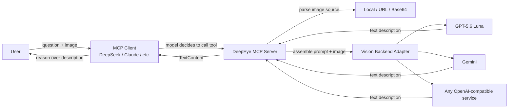

# DeepEye

> Give text-only LLMs a pair of eyes.

English | [简体中文](README.md)

[](https://www.python.org/)
[](https://modelcontextprotocol.io/)
[](#license)
[](#changelog)
[](#contributing)

DeepEye is an open-source **MCP (Model Context Protocol) Server** that brings vision capabilities to any MCP-compatible text-only large language model (e.g., DeepSeek V3/V4, Qwen text-only variants, Llama, etc.). The model itself never sees the image — DeepEye "sees" on its behalf and feeds the visual understanding back as text.

Deploy once, reuse from any MCP client (Claude Desktop, Cline, Cursor, custom agents, ...).

---

## Table of Contents

- [Why DeepEye](#why-deepeye)
- [Features](#features)
- [How It Works](#how-it-works)
- [Quick Start](#quick-start)
- [Tools](#tools)
- [Usage Examples](#usage-examples)
- [Configuration Reference](#configuration-reference)
- [MCP Client Integration](#mcp-client-integration)
- [Supported Vision Backends](#supported-vision-backends)
- [Development](#development)
- [Project Structure](#project-structure)
- [Roadmap](#roadmap)
- [Contributing](#contributing)
- [License](#license)
- [Acknowledgements](#acknowledgements)

---

## Why DeepEye

Powerful text-only LLMs like DeepSeek V4 Flash are exceptional reasoners — but they are born "blind": they cannot process images directly. Yet real-world tasks constantly call for vision: chart analysis, screenshot diagnostics, document OCR, UI reviews, and more.

The conventional answer is to switch to a multimodal model, but that means:

- Giving up the reasoning style and context window of your favorite text-only model
- Being locked into a specific multimodal vendor
- Every agent re-implementing vision support, reinventing the wheel

DeepEye uses the **MCP protocol** to decouple "visual understanding" from the model itself, exposing it as an independent tool layer:

- Keep using your favorite text-only model as the main reasoner
- When the model needs to see, it calls a DeepEye tool and receives a textual description
- The vision backend is pluggable — switch freely between OpenAI / Gemini / any OpenAI-compatible service
- Build once, use from every MCP client

> In one sentence: **a guide dog for "blind" models.**

---

## Features

- **Four core tools**: `describe_image` (caption), `extract_text` (OCR), `ask_about_image` (VQA), `analyze_layout` (UI layout structured analysis)
- **Standard MCP protocol**: built on the official `mcp` library, stdio transport, compatible with all MCP clients
- **Three switchable vision backends**: strategy + adapter pattern; supports OpenAI (GPT-5.6 Luna, etc.), Google Gemini (gemini-1.5-pro / gemini-2.0-flash, etc.), and custom OpenAI-compatible services (Alibaba Qwen-VL / Zhipu / vLLM / Ollama, etc.). Switch instantly via `VISION_PROVIDER` — no code changes required
- **Three image sources**: local path / public URL / Base64 data URI, unified parsing
- **Image preprocessing**: oversized images are auto-downscaled proportionally (default 2048px) and converted to JPEG, reducing token consumption
- **Result caching**: optional LRU + TTL cache; repeated images skip redundant API calls
- **Minimal deployment**: clone → install → fill in an API key → run; no account, no sign-up
- **Zero intrusion**: doesn't modify the model itself; a transparent tool layer on top of the main reasoning loop
- **Open source**: MIT license, community-driven

---

## How It Works



Core flow: **receive image → call vision model → return text description**. The main model reasons over the text DeepEye returns, as if it had "seen" the image itself.

---

## Quick Start

### Install from PyPI (Recommended)

```bash
pip install deepeye-mcp
```

The `deepeye` command is available immediately — no need to clone the source.

### Install with a Coding Agent

If you use an AI coding agent (Claude Code / Codex / Cursor / Cline), send it this prompt and let it handle installing and configuring for you:

> Install the Python package `deepeye-mcp` (pip install deepeye-mcp), then walk me through configuring a vision model API key using the `.env.example` from https://github.com/ouli-1242/deepeye-mcp and wire it into my current MCP client.

### Prerequisites

- **Python 3.11+**
- A vision model API key (recommend [OpenAI GPT-5.6 Luna](https://platform.openai.com/) — prices dropped 80% on 2026-07-31, now $0.2 / 1M input tokens and $1.2 / 1M output tokens; positioned as a "fast, affordable model for everyday work", ideal for high-volume calls and agent workflows; or any OpenAI-compatible service such as [Alibaba Qwen-VL](https://dashscope.aliyun.com/), [Zhipu GLM-4V](https://open.bigmodel.cn/), etc.)

### Install from source (Developers)

```bash
git clone https://github.com/ouli-1242/deepeye-mcp.git
cd deepeye

# Recommended: isolated virtual environment
python -m venv .venv
# Windows
.venv\Scripts\activate
# macOS / Linux
source .venv/bin/activate

pip install -e ".[dev]"
```

After installation, the `deepeye` command is registered on your PATH.

### 2. Configure your API key

```bash
cp .env.example .env
```

Edit `.env` and fill in your vision model API key:

```dotenv
VISION_PROVIDER=openai
OPENAI_API_KEY=sk-your-real-key-here
OPENAI_MODEL=gpt-5.6-luna
# For a compatible service, set OPENAI_BASE_URL instead
# OPENAI_BASE_URL=https://your-compatible-service/v1
```

### 3. Run the server

```bash
deepeye
```

The server speaks stdio with MCP clients; running it standalone won't open an interactive UI. Pair it with an MCP client (see [MCP Client Integration](#mcp-client-integration)).

---

## Tools

DeepEye exposes four MCP-compliant tools:

### `describe_image` — General image understanding

Produces a detailed description of an image, with an optional custom angle.

| Parameter | Type | Required | Description |
|-----------|------|----------|-------------|
| `image_source` | string | yes | Local path / http(s) URL / `data:image/...;base64,...` |
| `prompt` | string | no | Captioning prompt; defaults to a detailed description |
| `model` | string | no | Override the vision model for this call |

**Returns**: `Image analysis result:\n{description}`

### `extract_text` — OCR

Extracts text only, preserving original layout, with no extra commentary.

| Parameter | Type | Required | Description |
|-----------|------|----------|-------------|
| `image_source` | string | yes | Same as above |
| `language` | string | no | Recognition language; `auto` (default) auto-detects; other values (e.g. `zh`, `en`) add a language hint |

**Returns**: The plain text extracted from the image.

### `ask_about_image` — Visual question answering

Answers a specific question about the image.

| Parameter | Type | Required | Description |
|-----------|------|----------|-------------|
| `image_source` | string | yes | Same as above |
| `question` | string | yes | The question to ask |

**Returns**: The answer to the question.

### `analyze_layout` — UI layout structured analysis

Produces a structured JSON description of an image's UI layout — layout type plus an element tree (type / position / styles) — ideal for frontend replication.

| Parameter | Type | Required | Description |
|-----------|------|----------|-------------|
| `image_source` | string | yes | Same as above |
| `detail` | string | no | Level of detail: `basic` (default, type + text + position only) or `detailed` (also returns colors, font size, border radius, and other styles) |
| `model` | string | no | Override the vision model for this call |

**Returns**: A JSON string with `layout_type`, `summary`, and an `elements` tree; each element includes `type`, `text`, `position` (percentage coordinates), and `children`. `detailed` mode additionally returns `styles`.

---

## Usage Examples

### Scenario: Diagnose "users can't find the settings button" with DeepSeek V4 Flash analyzing a screenshot

**User**:

> Please analyze `screenshot.png` and find the likely reasons users can't locate the settings button.

**Model (DeepSeek V4 Flash) internals**:

1. Recognizes it needs visual input → decides to call `describe_image`
2. Invokes the tool:

   ```json
   {
     "name": "describe_image",
     "arguments": {
       "image_source": "/Users/me/screenshot.png",
       "prompt": "From a UI/UX designer's perspective, describe this webpage screenshot in detail: layout, element visibility, and potential UX issues, with special attention to 'settings' buttons."
     }
   }
   ```

3. DeepEye returns a textual description:

   > The screenshot shows an e-commerce account page. The top has the user's avatar and name, followed by three large tab-style navigation buttons: 'My Orders', 'Coupons', 'My Favorites'. At the very bottom of the page is a line of very small, grayish-white text link: 'Account Settings'...

4. The model reasons over the description and answers:

   > Based on the image analysis, there are three reasons users can't find the settings button:
   > 1. **Extremely low visual hierarchy**: 'Account Settings' is tucked into small text at the bottom, in stark contrast to the brightly colored icons at the top — easy to overlook entirely.
   > 2. **Violates mental models**: In most apps, 'Settings' lives near a gear icon in the top-right or around the avatar. Placing it at the bottom breaks convention.
   > 3. **Insufficient color contrast**: Light gray text on a white background is hard to discern.
   > Suggestion: surface 'Settings' as an icon in the upper half of the page.

### Scenario: OCR a weekly report

```json
{
  "name": "extract_text",
  "arguments": {"image_source": "/Users/me/weekly-report.png", "language": "zh"}
}
```

Returns:

> Project Weekly Report
> Date: 2026-07-31
> Progress: 95% complete
> Risks: None

### Scenario: Visual Q&A

```json
{
  "name": "ask_about_image",
  "arguments": {"image_source": "/Users/me/cats.jpg", "question": "How many cats are in the image?"}
}
```

Returns:

> There are two cats. An orange tabby is lying on the sofa, and a black cat is peeking out from behind the door.

### Scenario: UI layout structured analysis (frontend replication)

**User**:

> Analyze the layout of `navbar.png` and return detailed styles

**Model internals**: calls `analyze_layout` (detailed mode) → gets structured JSON → generates replication code from the JSON

Example JSON returned:

```json
{
  "layout_type": "header-nav",
  "summary": "Top horizontal navigation bar with logo and 4 links",
  "elements": [
    {
      "type": "nav",
      "position": {"x": 0, "y": 0, "width": 100, "height": 8},
      "styles": {"background_color": "#1a1a2e", "padding": "16px 24px"},
      "children": [
        {"type": "image", "text": "Logo", "position": {"x": 2, "y": 2, "width": 10, "height": 4}},
        {"type": "link", "text": "Home", "position": {"x": 60, "y": 2, "width": 8, "height": 4}},
        {"type": "link", "text": "Products", "position": {"x": 70, "y": 2, "width": 8, "height": 4}}
      ]
    }
  ]
}
```

---

## Configuration Reference

All configuration is loaded from environment variables or a `.env` file (see `.env.example`):

| Variable | Default | Description |
|----------|---------|-------------|
| `VISION_PROVIDER` | `openai` | Vision backend provider: `openai` / `gemini` / `custom` (all three implemented; switch freely) |
| `OPENAI_API_KEY` | — | API key for OpenAI or a compatible service |
| `OPENAI_MODEL` | `gpt-5.6-luna` | Vision model name |
| `OPENAI_BASE_URL` | — | API endpoint; leave empty for the official `https://api.openai.com/v1`; can point to Azure / a proxy / a compatible service |
| `GEMINI_API_KEY` | — | Gemini backend API key |
| `GEMINI_MODEL` | `gemini-1.5-pro` | Gemini model name |
| `CUSTOM_API_KEY` | — | Custom OpenAI-compatible service API key |
| `CUSTOM_BASE_URL` | — | Custom service endpoint |
| `CUSTOM_MODEL` | `qwen-vl-max` | Custom model name |
| `OCR_BACKEND` | `openai` | The vision backend actually used by `extract_text` |
| `IMAGE_MAX_DIM` | `1536` | Max image edge length (px) for preprocessing; larger images are downscaled proportionally and converted to JPEG. `0` disables preprocessing |
| `CACHE_ENABLED` | `true` | Enable vision result caching (LRU + TTL) |
| `CACHE_MAX_SIZE` | `128` | Max number of cache entries |
| `CACHE_TTL` | `3600` | Cache TTL in seconds |
| `REQUEST_TIMEOUT` | `120` | HTTP request timeout for vision backend (seconds) |
| `MAX_RETRIES` | `3` | Retry count on network/timeout errors (no retry on 4xx) |
| `MAX_TOKENS` | `1024` | Max tokens returned by the vision model |

**Example with a compatible service** (Alibaba Qwen-VL):

```dotenv
VISION_PROVIDER=openai
OPENAI_API_KEY=sk-your-dashscope-key
OPENAI_MODEL=qwen-vl-max
OPENAI_BASE_URL=https://dashscope.aliyuncs.com/compatible-mode/v1
```

**Switching to other vision backends**:

```bash
# Switch to Gemini
VISION_PROVIDER=gemini
GEMINI_API_KEY=your-key
GEMINI_MODEL=gemini-2.0-flash

# Or a custom OpenAI-compatible service (e.g., Alibaba Qwen-VL)
VISION_PROVIDER=custom
CUSTOM_API_KEY=your-key
CUSTOM_BASE_URL=https://dashscope.aliyuncs.com/compatible-mode/v1
CUSTOM_MODEL=qwen-vl-max
```

---

## MCP Client Integration

DeepEye is a standard stdio MCP Server that works with any MCP-compatible client (Claude Code, Codex CLI, opencode, Cursor, Cline, Windsurf, Continue, Zed, Roo Code, etc.). Configuration is consistent across clients: declare the `deepeye` launch command in the MCP config and pass vision backend credentials via the `env` field.

Minimal example (Claude Code, one-line CLI):

```bash
claude mcp add deepeye -- /path/to/deepeye/.venv/bin/deepeye
```

For the full configuration guide covering 9 clients, see [Coding Agent Integration Guide](docs/coding-agent-integration.md) (currently in Chinese).

> **opencode users**: Install the [opencode-easy-vision](https://github.com/devadathanmb/opencode-easy-vision) plugin to enable seamless "paste image → auto-analyze" workflow. The plugin saves pasted images to temp files and automatically invokes DeepEye's `describe_image` tool. See the [opencode section](docs/coding-agent-integration.md#进阶粘贴图片自动调用-deepeyeopencode-easy-vision-插件) in the integration guide.

---

## Supported Vision Backends

| Backend | Status | Notes |
|---------|--------|-------|
| **OpenAI-compatible** | Implemented | Works with OpenAI official, Azure OpenAI, Alibaba Qwen-VL, Zhipu GLM-4V, Moonshot, etc. |
| **Gemini** | Implemented | Supports Google Gemini models (gemini-1.5-pro / gemini-2.0-flash, etc.) |
| **Custom OpenAI-compatible** | Implemented | For any self-hosted service that speaks OpenAI Chat Completions (vLLM / Ollama / Alibaba Qwen-VL / Zhipu, etc.) |
| Local OCR (Tesseract / PaddleOCR) | Planned | Keeps data on-device for privacy-sensitive scenarios |

---

## Development

### Local dev setup

```bash
git clone <your-repo-url> deepeye
cd deepeye
python -m venv .venv
source .venv/bin/activate    # Windows: .venv\Scripts\activate
pip install -e ".[dev]"
```

### Run tests

```bash
pytest tests/ -v
```

Tests cover image source parsing, the vision adapter factory, and prompt assembly for all four tools. All tests use mocks — no real API calls are made.

### Code layout

See [Project Structure](#project-structure). Vision backends follow the strategy pattern; adding one is a matter of:

1. Creating `src/deepeye_mcp/vision/xxx_adapter.py` that subclasses `VisionAdapter` and implements `describe`
2. Registering a new branch in the `vision/__init__.py` factory

---

## Project Structure

```
deepeye/
├── pyproject.toml              # Project metadata, dependencies, entry command, pytest config
├── .env.example                # Configuration sample
├── README.md                   # Chinese README (primary)
├── README.en.md                # English README
├── src/
│   └── deepeye/
│       ├── __init__.py         # __version__
│       ├── server.py           # MCP Server assembly (mcp 2.0 API)
│       ├── tools.py            # The four MCP tools
│       ├── image_utils.py      # Image source parsing (local / URL / data URI)
│       ├── config.py           # pydantic-settings config loading
│       └── vision/
│           ├── __init__.py     # create_vision_adapter factory
│           ├── base.py         # VisionAdapter abstract base
│           └── openai_adapter.py
└── tests/
    ├── test_image_utils.py
    ├── test_vision_factory.py
    └── test_tools.py
```

---

## Roadmap

- [x] OpenAI-compatible vision backend
- [x] Three image sources (local / URL / Base64)
- [x] Three core tools (describe / OCR / VQA)
- [x] Multi-backend vision support (Gemini + Custom adapters)
- [x] Performance optimization (image preprocessing + result caching)
- [ ] Tesseract / PaddleOCR local OCR backend
- [ ] Video keyframe analysis tool
- [ ] Multi-model pipeline (e.g., GPT-5.6 Luna classifies first, then routes to a specialized model)
- [x] Publish to PyPI (`pip install deepeye-mcp`)

---

## Contributing

Issues and PRs welcome!

- **Bug reports / feature requests**: open an Issue describing the scenario and expected behavior
- **Code contributions**: open a PR with a clear title; ensure `pytest` passes
- **New vision backends**: see `vision/openai_adapter.py` for a reference `VisionAdapter` subclass, then register it in the factory
- **Docs improvements**: README / examples / config docs all welcome

### Contribution flow

1. Fork the repo
2. Create a branch: `git checkout -b feat/your-feature`
3. Commit: `git commit -m "feat: add xxx"`
4. Push: `git push origin feat/your-feature`
5. Open a Pull Request

---

## License

[MIT](LICENSE) © DeepEye Contributors

---

## Acknowledgements

- [Model Context Protocol](https://modelcontextprotocol.io/) — the standardized model context protocol
- [DeepSeek](https://www.deepseek.com/) — a powerful text-only reasoner, the inspiration behind DeepEye
- All vision model providers (OpenAI / Google / Alibaba / Zhipu, etc.) — for making "seeing" possible

---

<p align="center">
  If DeepEye helps you, a Star goes a long way in helping others discover it.
</p>
