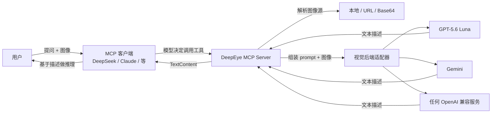

# DeepEye

> 给纯文本大模型装上一双眼睛。

[English](README.en.md) | 简体中文

[](https://www.python.org/)
[](https://modelcontextprotocol.io/)
[](#license)
[](#changelog)
[](#contributing)

DeepEye 是一个开源的 **MCP (Model Context Protocol) Server**，为任何支持 MCP 的纯文本大模型（如 DeepSeek V3/V4、Qwen 纯文本版、Llama 等）赋予视觉能力。模型本身不需要看图——DeepEye 替它"看"，再把看到的内容用文字告诉它。

一次部署，任何 MCP 客户端（Claude Desktop、Cline、Cursor、自建 Agent 等）均可复用。

---

## 目录

- [为什么需要 DeepEye](#为什么需要-deepeye)
- [特性](#特性)
- [工作原理](#工作原理)
- [快速开始](#快速开始)
- [工具一览](#工具一览)
- [使用示例](#使用示例)
- [配置参考](#配置参考)
- [MCP 客户端集成](#mcp-客户端集成)
- [支持的视觉后端](#支持的视觉后端)
- [开发](#开发)
- [项目结构](#项目结构)
- [路线图](#路线图)
- [贡献](#contributing)
- [License](#license)
- [致谢](#致谢)

---

## 为什么需要 DeepEye

像 DeepSeek V4 Flash 这样的纯文本大模型，推理能力极强，却天生"看不见"——无法直接处理图像。而现实任务里，图表分析、截图诊断、文档 OCR、UI 走查常常不可或缺。

传统做法是换一个多模态模型，但这意味着：

- 放弃你喜爱的纯文本模型的推理风格与上下文长度
- 被某一个多模态厂商绑定
- 每个 Agent 各自集成视觉能力，重复造轮子

DeepEye 用 **MCP 协议**把"视觉理解"从模型本体中解耦出来，做成一个独立的工具层：

- 你继续用最爱的纯文本模型做主推理
- 模型需要看图时，自动调用 DeepEye 工具拿到文字描述
- 视觉后端可插拔，OpenAI / Gemini / 任何 OpenAI 兼容服务随意切换
- 一次开发，所有 MCP 客户端都能用

> 一句话：**给"盲人"模型配一条"导盲犬"。**

---

## 特性

- **四个核心工具**：`describe_image`（图像描述）、`extract_text`（OCR）、`ask_about_image`（视觉问答）、`analyze_layout`（UI 布局结构化分析）
- **标准 MCP 协议**：基于官方 `mcp` 库，stdio 传输，兼容所有 MCP 客户端
- **三类视觉后端可切换**：策略模式 + 适配器模式，已支持 OpenAI（GPT-5.6 Luna 等）、Google Gemini（gemini-1.5-pro / gemini-2.0-flash 等）、自定义 OpenAI 兼容服务（通义 Qwen-VL / 智谱 / vLLM / Ollama 等），通过 `VISION_PROVIDER` 一键切换，不改代码
- **三种图像来源**：本地路径 / 公网 URL / Base64 data URI，统一解析
- **图片预处理**：超大图自动等比缩放（默认 2048px）转 JPEG，减少 token 消耗
- **结果缓存**：可选 LRU + TTL 缓存，重复图片不重复调用 API
- **极简部署**：克隆 → 安装 → 填 API Key → 启动，无需账号、无需注册
- **零侵入**：不修改模型本体，纯工具层增强，对主推理流程透明
- **开放开源**：MIT 协议，社区共建

---

## 工作原理



核心流程：**接收图像 → 调用视觉模型 → 返回文本描述**。主模型基于 DeepEye 返回的文字描述继续推理，仿佛自己"看见"了图片。

---

## 快速开始

### 从 PyPI 安装（推荐）

```bash
pip install deepeye-mcp
```

安装后命令 `deepeye` 即可用，无需克隆源码。

### 使用 Coding Agent 安装

如果你用 Claude Code / Codex / Cursor / Cline 等 AI coding agent，直接把下面这段发给它，让它帮你完成安装与配置：

> 安装 Python 包 `deepeye-mcp`（pip install deepeye-mcp），然后参照 https://github.com/ouli-1242/deepeye-mcp 的 `.env.example` 指导我配置视觉模型 API Key，并帮我接入到当前的 MCP 客户端。

### 环境要求

- **Python 3.11+**
- 一个视觉模型 API Key（推荐 [OpenAI GPT-5.6 Luna](https://platform.openai.com/)——2026-07-31 起降价 80%，每百万 token 输入 $0.2 / 输出 $1.2，定位"快速、实惠的日常主力模型"，适合高频调用与 Agent 工作流；或任何 OpenAI 兼容服务如 [阿里通义 Qwen-VL](https://dashscope.aliyun.com/)、[智谱 GLM-4V](https://open.bigmodel.cn/) 等）

### 从源码安装（开发者）

```bash
git clone https://github.com/ouli-1242/deepeye-mcp.git
cd deepeye

# 推荐使用虚拟环境
python -m venv .venv
# Windows
.venv\Scripts\activate
# macOS / Linux
source .venv/bin/activate

pip install -e ".[dev]"
```

安装后，命令 `deepeye` 会注册到环境中。

### 2. 配置 API Key

```bash
cp .env.example .env
```

编辑 `.env`，填入你的视觉模型 API Key：

```dotenv
VISION_PROVIDER=openai
OPENAI_API_KEY=sk-your-real-key-here
OPENAI_MODEL=gpt-5.6-luna
# 如果用兼容服务，可改 OPENAI_BASE_URL
# OPENAI_BASE_URL=https://your-compatible-service/v1
```

### 3. 启动 Server

```bash
deepeye
```

Server 通过 stdio 与 MCP 客户端通信，单独运行不会输出交互界面，需要配合 MCP 客户端使用（见 [MCP 客户端集成](#mcp-客户端集成)）。

---

## 工具一览

DeepEye 暴露四个符合 MCP 规范的工具：

### `describe_image` — 通用图像理解

对图片进行详细描述，可自定义描述角度。

| 参数 | 类型 | 必需 | 说明 |
|------|------|------|------|
| `image_source` | string | 是 | 本地路径 / http(s) URL / `data:image/...;base64,...` |
| `prompt` | string | 否 | 描述提示词，不传则使用默认详细描述 |
| `model` | string | 否 | 临时指定视觉模型，不传则用配置默认值 |

**返回**：`图片分析结果：\n{描述}`

### `extract_text` — OCR 文字提取

仅提取图片中的文字，保持原文排版，不加任何额外描述。

| 参数 | 类型 | 必需 | 说明 |
|------|------|------|------|
| `image_source` | string | 是 | 同上 |
| `language` | string | 否 | 识别语言，`auto`（默认）自动识别；其他值如 `zh` / `en` 会附加语言提示 |

**返回**：图片中提取到的纯文字。

### `ask_about_image` — 视觉问答

针对图片内容提出具体问题，获取定向回答。

| 参数 | 类型 | 必需 | 说明 |
|------|------|------|------|
| `image_source` | string | 是 | 同上 |
| `question` | string | 是 | 要询问的问题 |

**返回**：针对问题的回答。

### `analyze_layout` — UI 布局结构化分析

对图片进行 UI 布局结构化分析，返回 JSON 格式的布局类型与元素树（类型/位置/样式），适合前端复刻。

| 参数 | 类型 | 必需 | 说明 |
|------|------|------|------|
| `image_source` | string | 是 | 同上 |
| `detail` | string | 否 | 分析粒度：`basic`（默认，仅类型 + 文本 + 位置）或 `detailed`（额外返回颜色、字号、圆角等样式） |
| `model` | string | 否 | 临时指定视觉模型，不传则用配置默认值 |

**返回**：JSON 字符串，包含 `layout_type`（布局类型）、`summary`（一句话描述）与 `elements`（元素树）；每个元素含 `type`、`text`、`position`（百分比坐标）、`children`，`detailed` 模式额外返回 `styles`。

---

## 使用示例

### 场景：用 DeepSeek V4 Flash 分析网页截图，诊断"用户找不到设置按钮"

**用户**：

> 请帮我分析 `screenshot.png` 这个网页截图，找出用户找不到设置按钮的可能原因。

**模型（DeepSeek V4 Flash）内部行为**：

1. 识别需要视觉信息 → 决定调用 `describe_image`
2. 调用工具：

   ```json
   {
     "name": "describe_image",
     "arguments": {
       "image_source": "/Users/me/screenshot.png",
       "prompt": "请从 UI/UX 设计师角度，详细描述这张网页截图的布局、元素可见性与潜在用户体验问题，特别关注'设置'相关按钮。"
     }
   }
   ```

3. DeepEye 返回文字描述：

   > 截图显示电商网站个人中心页。顶部是用户头像和用户名，下方有三个大型标签式导航按钮：'我的订单'、'优惠券'、'我的收藏'。页面最底部有一行非常小的灰白色文字链接：'账户设置'……

4. 模型基于描述推理，给出最终回答：

   > 根据图片分析，用户找不到设置按钮的原因有三点：
   > 1. **视觉层级极低**：'账户设置'入口被设计成页面底部的小字，与顶部鲜艳图标形成强烈对比，极易被忽略。
   > 2. **违反心智模型**：绝大多数应用'设置'入口位于右上角齿轮图标或头像附近，而该界面放在底部。
   > 3. **色彩对比度不足**：灰白色文字在白底上辨识度不高。
   > 建议将'设置'以图标形式放置在页面上半部分。

### 场景：OCR 提取周报内容

```json
{
  "name": "extract_text",
  "arguments": {"image_source": "/Users/me/weekly-report.png", "language": "zh"}
}
```

返回：

> 项目进展周报
> 日期：2026-07-31
> 进度：已完成 95%
> 风险：无

### 场景：视觉问答

```json
{
  "name": "ask_about_image",
  "arguments": {"image_source": "/Users/me/cats.jpg", "question": "图中有几只猫？"}
}
```

返回：

> 图中有两只猫。一只橘猫趴在沙发上，一只黑猫正从门后探出头来。

### 场景：UI 布局结构化分析（前端复刻）

**用户**：

> 分析 `navbar.png` 这个导航栏的布局结构，返回详细样式

**模型内部行为**：调用 `analyze_layout`（detailed 模式）→ 获得结构化 JSON → 基于 JSON 生成复刻代码

返回的 JSON 示例：

```json
{
  "layout_type": "header-nav",
  "summary": "顶部水平导航栏，含 logo 和 4 个链接",
  "elements": [
    {
      "type": "nav",
      "position": {"x": 0, "y": 0, "width": 100, "height": 8},
      "styles": {"background_color": "#1a1a2e", "padding": "16px 24px"},
      "children": [
        {"type": "image", "text": "Logo", "position": {"x": 2, "y": 2, "width": 10, "height": 4}},
        {"type": "link", "text": "首页", "position": {"x": 60, "y": 2, "width": 8, "height": 4}},
        {"type": "link", "text": "产品", "position": {"x": 70, "y": 2, "width": 8, "height": 4}}
      ]
    }
  ]
}
```

---

## 配置参考

所有配置通过环境变量或 `.env` 文件加载（参考 `.env.example`）：

| 变量 | 默认值 | 说明 |
|------|--------|------|
| `VISION_PROVIDER` | `openai` | 视觉后端提供者：`openai` / `gemini` / `custom`（三类均已实现，可自由切换） |
| `OPENAI_API_KEY` | — | OpenAI 或兼容服务的 API Key |
| `OPENAI_MODEL` | `gpt-5.6-luna` | 视觉模型名称 |
| `OPENAI_BASE_URL` | — | 接口地址，留空用官方 `https://api.openai.com/v1`；可改为 Azure / 代理 / 兼容服务 |
| `GEMINI_API_KEY` | — | Gemini 后端 API Key |
| `GEMINI_MODEL` | `gemini-1.5-pro` | Gemini 模型名称 |
| `CUSTOM_API_KEY` | — | 自定义 OpenAI 兼容服务 Key |
| `CUSTOM_BASE_URL` | — | 自定义服务接口地址 |
| `CUSTOM_MODEL` | `qwen-vl-max` | 自定义模型名称 |
| `OCR_BACKEND` | `openai` | `extract_text` 实际使用的视觉后端 |
| `IMAGE_MAX_DIM` | `1536` | 图片预处理最大边长（像素），超过则等比缩放转 JPEG。`0` 禁用预处理 |
| `CACHE_ENABLED` | `true` | 是否开启视觉结果缓存（LRU + TTL） |
| `CACHE_MAX_SIZE` | `128` | 缓存最大条目数 |
| `CACHE_TTL` | `3600` | 缓存存活秒数 |
| `REQUEST_TIMEOUT` | `120` | 视觉后端 HTTP 请求超时（秒） |
| `MAX_RETRIES` | `3` | 失败重试次数（仅对网络/超时错误重试） |
| `MAX_TOKENS` | `1024` | 视觉模型返回的最大 token 数 |

**用兼容服务的例子**（以阿里通义 Qwen-VL 为例）：

```dotenv
VISION_PROVIDER=openai
OPENAI_API_KEY=sk-your-dashscope-key
OPENAI_MODEL=qwen-vl-max
OPENAI_BASE_URL=https://dashscope.aliyuncs.com/compatible-mode/v1
```

**切换到其他视觉后端**：

```bash
# 切换到 Gemini
VISION_PROVIDER=gemini
GEMINI_API_KEY=你的key
GEMINI_MODEL=gemini-2.0-flash

# 或自定义 OpenAI 兼容服务（如通义 Qwen-VL）
VISION_PROVIDER=custom
CUSTOM_API_KEY=你的key
CUSTOM_BASE_URL=https://dashscope.aliyuncs.com/compatible-mode/v1
CUSTOM_MODEL=qwen-vl-max
```

---

## MCP 客户端集成

DeepEye 是标准 stdio MCP Server，可接入任何支持 MCP 的客户端（Claude Code、Codex CLI、opencode、Cursor、Cline、Windsurf、Continue、Zed、Roo Code 等）。各客户端配置方式高度一致：在 MCP 配置中声明 `deepeye` 启动命令，并通过 `env` 字段传入视觉后端凭证。

最小示例（Claude Code 一行 CLI 接入）：

```bash
claude mcp add deepeye -- /path/to/deepeye/.venv/bin/deepeye
```

完整的 9 个客户端配置教程见 [接入 Coding Agent 指南](docs/coding-agent-integration.md)。

> **opencode 用户**：安装 [opencode-easy-vision](https://github.com/devadathanmb/opencode-easy-vision) 插件后，粘贴图片会自动保存为临时文件并调用 DeepEye 分析，实现"粘贴即用"的无缝体验。配置方法见 [接入指南的 opencode 章节](docs/coding-agent-integration.md#进阶粘贴图片自动调用-deepeyeopencode-easy-vision-插件)。

---

## 支持的视觉后端

| 后端 | 状态 | 说明 |
|------|------|------|
| **OpenAI 兼容** | 已实现 | 支持 OpenAI 官方、Azure OpenAI、阿里通义 Qwen-VL、智谱 GLM-4V、Moonshot 等 |
| **Gemini** | 已实现 | 支持 Google Gemini 系列模型（gemini-1.5-pro / gemini-2.0-flash 等） |
| **自定义 OpenAI 兼容** | 已实现 | 用于任何兼容 OpenAI Chat Completions 格式的自部署服务（vLLM / Ollama / 通义 Qwen-VL / 智谱等） |
| 本地 OCR (Tesseract / PaddleOCR) | 计划中 | 隐私场景下数据不出本机 |

---

## 开发

### 本地开发环境

```bash
git clone <your-repo-url> deepeye
cd deepeye
python -m venv .venv
source .venv/bin/activate    # Windows: .venv\Scripts\activate
pip install -e ".[dev]"
```

### 运行测试

```bash
pytest tests/ -v
```

测试覆盖图像源解析、视觉适配器工厂、四个工具的 prompt 组装逻辑，全部使用 mock，不发起真实 API 调用。

### 代码结构

详见 [项目结构](#项目结构)。视觉后端采用策略模式，新增后端只需：

1. 在 `src/deepeye_mcp/vision/` 下新增 `xxx_adapter.py`，继承 `VisionAdapter`，实现 `describe` 方法
2. 在 `vision/__init__.py` 的工厂函数中注册新分支

---

## 项目结构

```
deepeye/
├── pyproject.toml              # 项目元数据、依赖、入口命令、pytest 配置
├── .env.example                # 配置示例
├── README.md
├── src/
│   └── deepeye/
│       ├── __init__.py         # __version__
│       ├── server.py           # MCP Server 组装（mcp 2.0 API）
│       ├── tools.py            # 四个 MCP 工具实现
│       ├── image_utils.py      # 图像源解析（本地/URL/data URI）
│       ├── config.py           # pydantic-settings 配置加载
│       └── vision/
│           ├── __init__.py     # create_vision_adapter 工厂
│           ├── base.py         # VisionAdapter 抽象基类
│           └── openai_adapter.py
└── tests/
    ├── test_image_utils.py
    ├── test_vision_factory.py
    └── test_tools.py
```

---

## 路线图

- [x] OpenAI 兼容视觉后端
- [x] 三种图像来源（本地 / URL / Base64）
- [x] 三个核心工具（describe / OCR / VQA）
- [x] 多视觉后端支持（Gemini + Custom 适配器）
- [x] 性能优化（图片预处理 + 结果缓存）
- [ ] Tesseract / PaddleOCR 本地 OCR 后端
- [ ] 视频关键帧分析工具
- [ ] 多模型链路（先 GPT-5.6 Luna 识别类型，再切专业模型处理）
- [x] 发布到 PyPI（`pip install deepeye-mcp`）

---

## Contributing

欢迎 Issue 与 PR！

- **Bug 报告 / 功能建议**：开 Issue 描述场景与期望行为
- **代码贡献**：开 PR，标题写明意图，确保 `pytest` 通过
- **新视觉后端**：参考 `vision/openai_adapter.py` 实现 `VisionAdapter` 子类，并在工厂注册
- **文档改进**：README / 示例 / 配置说明的优化都欢迎

### 贡献流程

1. Fork 仓库
2. 新建分支：`git checkout -b feat/your-feature`
3. 提交改动：`git commit -m "feat: add xxx"`
4. 推送：`git push origin feat/your-feature`
5. 提交 Pull Request

---

## License

[MIT](LICENSE) © DeepEye Contributors

---

## 致谢

- [Model Context Protocol](https://modelcontextprotocol.io/) — 标准化的模型上下文协议
- [DeepSeek](https://www.deepseek.com/) — 强大的纯文本推理模型，DeepEye 的灵感来源
- 所有视觉模型提供方（OpenAI / Google / 阿里 / 智谱等）—— 让"看见"成为可能

---

<p align="center">
  如果 DeepEye 帮到了你，欢迎点个 Star 让更多需要它的人看见。
</p>
